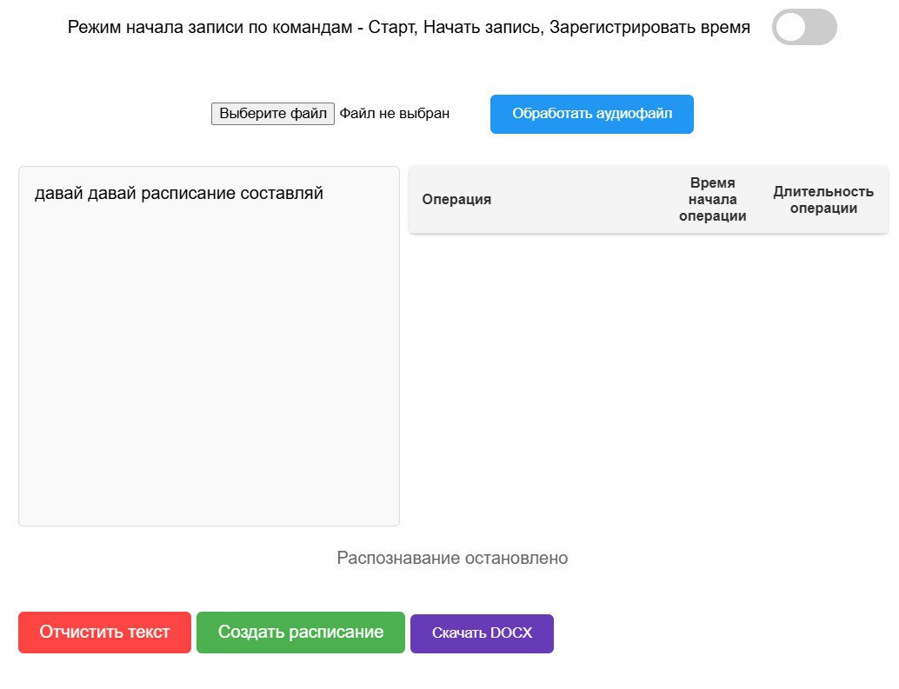

# <p align="center"> DiaBERT – инструмент для распознавания временных меток в голосовых данных </p>

Это решение обеспечивает точное распознавание речи (**ASR**) с помощью модели **Whisper** из аудиофайлов с последующим преобразованием в текстовый формат с помощью **LLM**, структурированный в виде **JSON**. Есть возможность сохранения в **DOCX**.

## ✨ Особенности:

- **Распознавание речи (ASR):**
  - Используется модель **Whisper-large-v3-turbo**, которая обеспечивает высокую точность распознавания речи на основе голосового ввода.
  - Поддержка различных языков и устойчивость к шумам.

- **Выделение временных меток:**
  - Сервис с помощью **LLM** автоматически определяет начало и конец каждой фразы или действия говорящего.
  - Выдает точные временные метки (начало и конец) для каждой записи.

- **Анализ содержания разговора:**
  - Используется модель **Llama-3.1-8B**, которая анализирует распознанный текст и выделяет ключевые действия или темы, обсуждаемые говорящим в определенные временные промежутки.
  - Результаты предоставляются в формате **JSON**, что упрощает дальнейшую обработку и интеграцию с другими системами.

## 🔥 Новости
- [2024/12/13] 🚀🚀 Решение опубликовано.

## 💡 Обзор возможностей
🔊 Ввод (Аудиозапись, распознается с помощью **Whisper**):
```
texts = [
    "С 10:00 до 11:00 я работал над проектом. С 11:00 до 12:00 у меня было совещание с командой."
]
```
💭 После обработки **LLM**:
```
{
    "С 10:00 до 11:00 я работал над проектом. С 11:00 до 12:00 у меня было совещание с командой.": [
        {
            "start": "10:00",
            "end": "11:00",
            "action": "работал над проектом"
        },
        {
            "start": "11:00",
            "end": "12:00",
            "action": "совещание с командой"
        }]
}
```
Доступен **удобный веб-интерфейс**



## ⚡️ Способы применения

- **Голосовые команды для учета времени:** Теперь отчеты во временных табелях можно создавать с помощью голосовых команд, что делает процесс максимально удобным и быстрым.  
- **Сохранение в DOCX одним кликом:** Отчеты легко сохраняются в формате DOCX всего одной кнопкой, обеспечивая самый удобный и эффективный учет времени.

## 🛠️ Установка:

1. Клонировать репозиторий
```
git clone https://github.com/VadimKirillov/ASR_DiaBERT
```
2. Установить зависимости в виртуальное окружение
```
pip3 install virtualenv
virtualenv myenv
. myenv/bin/activate
pip install -r requirements.txt
```
3. **Для запуска приложения необходимо ввести в консоль**
```
uvicorn main:app --ws websockets
```
